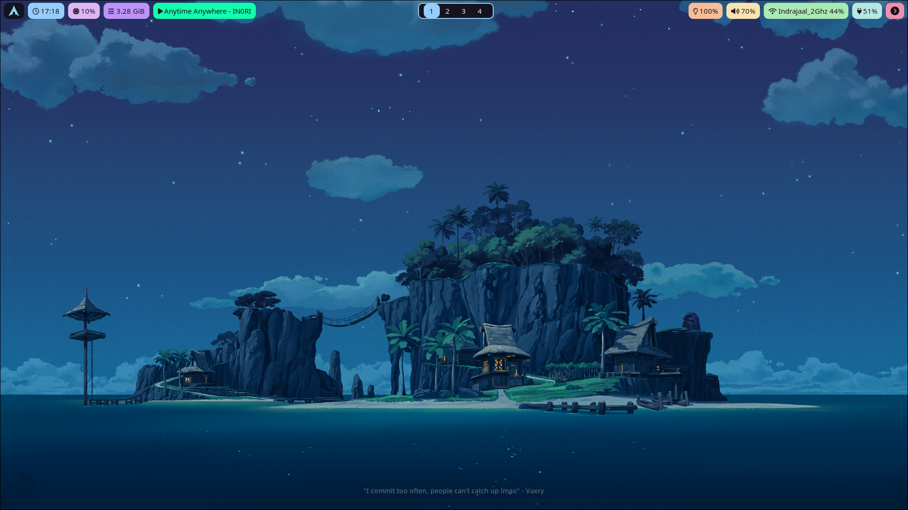

# dotfiles

dotfiles for my linux system.

## Screenshots

## Currently using

    - Arch Linux
    - Hyprland
    - Hyprpaper for screenshots
    - Waybar
    - Zsh as shell
    - Oh my zsh
    - Alacritty for terminal emulation
    - Nemo for file manager
    - NvChad + Neovim for text editing
